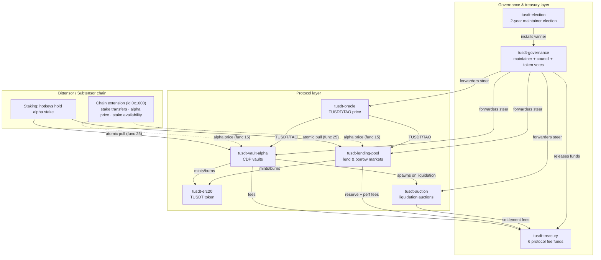

# TUSDT Contracts — User Guide

Welcome! This folder explains **what every contract in the TUSDT system does**, in plain
language — no architecture background needed. Each page starts with a short introduction,
then walks through the mechanics with the actual formulas and step-by-step user flows.

> **Companion docs**: every error the contracts can return is catalogued in
> [`../errors/`](../errors/index.md) — one page per contract.

## The system at a glance

TUSDT is a **collateralized stablecoin on Bittensor**. Its raw material is *subnet alpha* —
stake that validators and miners hold on Bittensor subnets. Alpha keeps earning staking
yield while it backs two things:

1. **Vaults (MakerDAO-style CDPs)** — deposit alpha, mint TUSDT.
2. **A lending pool (Aave/Compound-style)** — supply TAO/TUSDT to earn yield, or borrow
   against alpha collateral.

Liquidation auctions, an on-chain price oracle, a treasury, and a two-tier governance
system keep it all solvent and steerable.

## The contracts

| Contract | What it does in one line | Deep dive |
|---|---|---|
| `tusdt-erc20` | The TUSDT stablecoin token (PSP22, 9 decimals). Only authorized minters (vaults, pool) can mint/burn. | [erc20.md](erc20.md) |
| `tusdt-vault-alpha` | MakerDAO-style CDP: deposit subnet alpha, borrow TUSDT against it. No interest — repay 1:1. | [vault-alpha.md](vault-alpha.md) |
| `tusdt-auction` | Ascending-bid auction that sells a liquidated vault's alpha for TUSDT. | [auction.md](auction.md) |
| `tusdt-oracle` | Reports the single TUSDT/TAO price used by vaults and the pool. | [oracle.md](oracle.md) |
| `tusdt-lending-pool` | Aave/Compound-style money market: supply TAO/TUSDT to earn APY, borrow against alpha collateral. | [lending-pool.md](lending-pool.md) |
| `tusdt-treasury` | Books protocol fees in 6 named funds; only governance can release them. | [treasury.md](treasury.md) |
| `tusdt-governance` | Dual authority (elected maintainer + 5-member council) plus token-holder proposals that steer every protocol contract. | [governance.md](governance.md) |
| `tusdt-election` | Elects the maintainer — the top authority — for a 2-year term via Merkle-snapshot voting. | [election.md](election.md) |

## How the pieces fit together

### Story 1 — Mint TUSDT with a vault (MakerDAO-style)

1. You stake alpha under the vault's hotkey (or already have it there).
2. You call `create_alpha_vault(amount, netuid)`. The vault **atomically pulls** your alpha
   stake into its own coldkey and opens your position in the same message — no two-step
   deposit race.
3. You call `borrow_token(vault_id, amount)`. The vault mints fresh TUSDT up to
   `collateral_value ÷ collateral_ratio` (150% by default).
4. You repay later with `repay_token` — **1:1, no interest** — and release your alpha back.
5. If the alpha price falls and your `collateral ÷ debt` drops below the **liquidation
   ratio** (120%), anyone can trigger a liquidation auction, and your alpha is sold to the
   highest TUSDT bidder.

### Story 2 — Lend and borrow in the pool (Aave/Compound-style)

1. Supply TAO or TUSDT to the pool — you receive **lTAO/lTUSDT receipt tokens** whose
   exchange rate grows as interest accrues.
2. Deposit alpha as collateral — it keeps earning staking yield, and most of that yield
   (75%) boosts your borrowing power too.
3. Borrow TAO or TUSDT up to `collateral USD × collateral factor (50%)` minus existing
   debt, as long as your global **health factor stays ≥ 1.0**.
4. Interest is charged hourly at a utilization-based rate; repay any time, and repayments
   retire principal first.
5. Idle TAO is staked to the root subnet (1:1 TAO↔alpha) to earn yield; withdrawals and TAO
   borrows are topped up from that stake, and root dividends can later be harvested to the
   treasury.

### Story 3 — Who steers it all

The **maintainer** (elected for 2 years by `tusdt-election`) sets risk parameters — every
change goes through a **timelock (24 h)** before it can be executed. A **council** of 5 can hit
the emergency pause button. Token holders vote on funding/signal proposals using
`√(balance) × time-staked` voting power. After deployment, only governance can touch the
protocol contracts — it acts through thin **forwarders**.

## Numbers and scales (read this once)

All amounts on-chain are integers — there are no floats in TUSDT.

| Quantity | Scale | Example |
|---|---|---|
| Balance / token amount | `u64`, 9 decimals | 1 TUSDT = 1,000,000,000 units |
| Ratio (internal `FixedU128`) | 1e18 inner | 50% = 5 × 10¹⁷ |
| Parameter structs (external messages) | basis points | 5000 = 50% |
| Oracle price (TUSDT/TAO) | 1e18 | 250 TAO = 250 × 10¹⁸ |
| Alpha price (chain extension) | 1e9 (rao) | 1 TAO/α = 10⁹ |

## Where to go next

- New to the system? Start with [vault-alpha.md](vault-alpha.md), then
  [lending-pool.md](lending-pool.md).
- Hit an error? Look it up in [`../errors/`](../errors/index.md).
- Building on top? See the workspace `README.md` for deployment order and the canonical
  architecture notes in `.claude/CLAUDE.md`.
